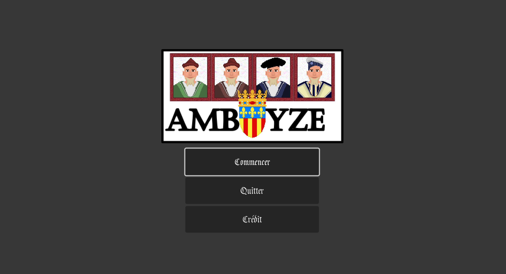
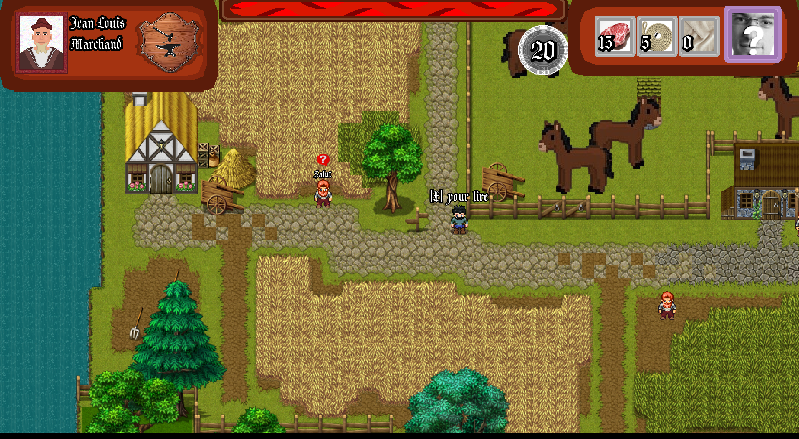
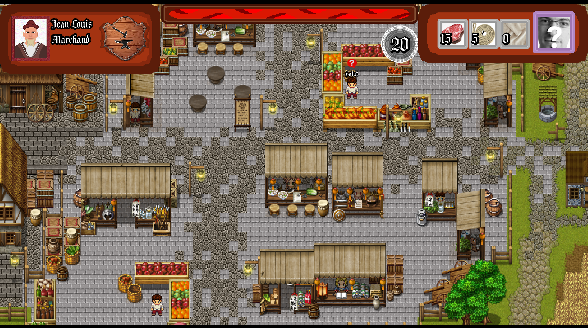

# Amboyze
### _Jeux sérieux sur la montée sociale à la renaissance_

Plongez au cœur de la Renaissance à Amboise, siège du roi de France, dans ce jeu éducatif 

## Téléchargement
*Ce jeu nécessite l'installation de Godot*

1) Télécharger l'archive/cloner le projet
2) 

## Documentation

| | |
| ------ | ------ |
| wiki/description | [WIKI.md][wiki] |
| Utiliser Godot | [site officiel de Godot][godot] |

[//]: # (Liens)

   [gamedl]: <Amboise.exe>
   [wiki]: <WIKI.md>
   [godot]: <https://godotengine.org/>
   [godotDownload]: <https://godotengine.org/download/>
